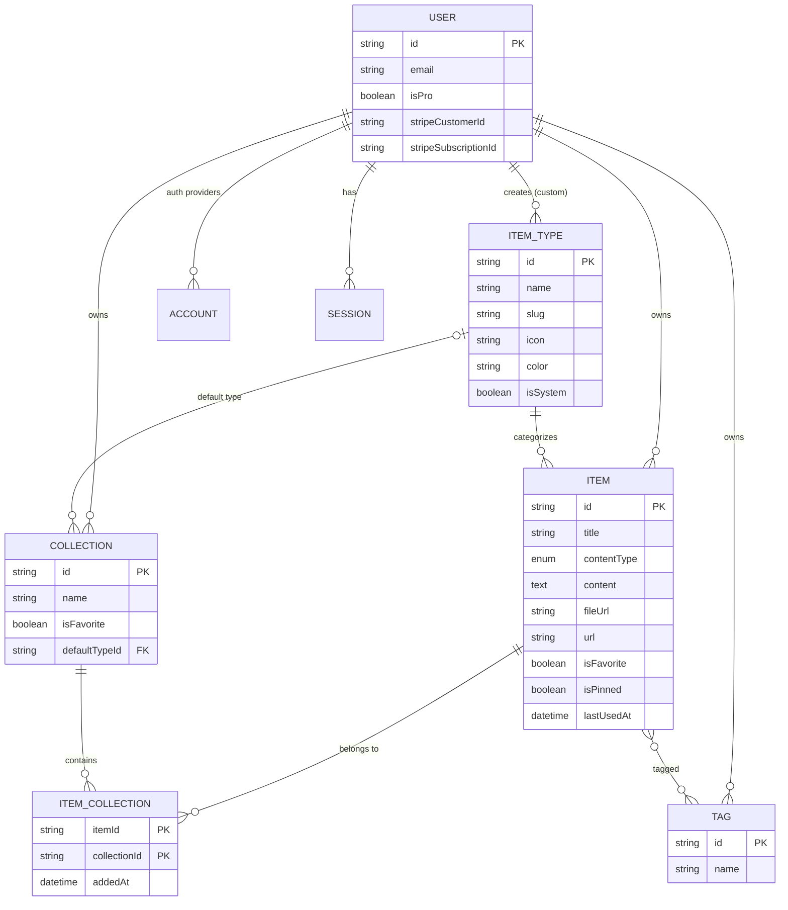
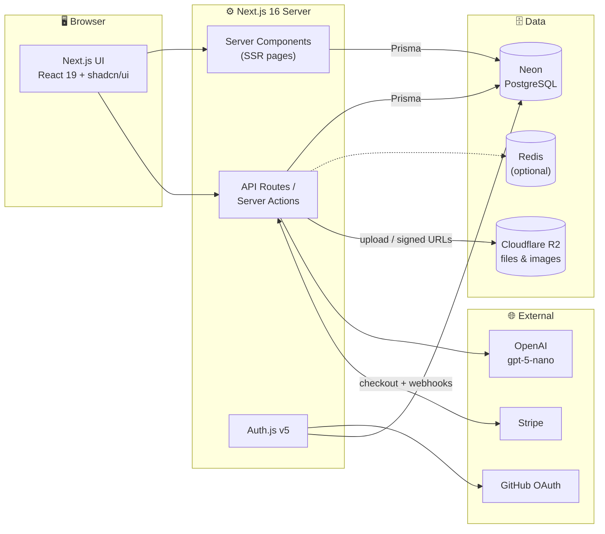
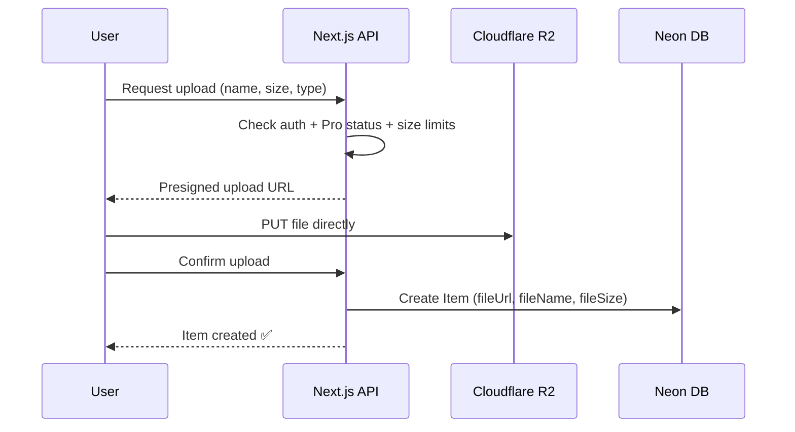

# 🗃️ DevStash — Project Overview

> **One fast, searchable, AI-enhanced hub for all your dev knowledge & resources.**

---

## 📌 Table of Contents

1. [Problem](#-problem)
2. [Target Users](#-target-users)
3. [Features](#-features)
4. [Data Model](#-data-model)
5. [Prisma Schema (Draft)](#-prisma-schema-draft)
6. [Tech Stack](#-tech-stack)
7. [Architecture](#-architecture)
8. [Routes](#-routes)
9. [Monetization](#-monetization)
10. [UI / UX](#-ui--ux)
11. [Development Rules](#-development-rules)
12. [Open Questions](#-open-questions)

---

## 🧩 Problem

Developers keep their essentials scattered across too many places:

| What | Where it usually lives |
| --- | --- |
| Code snippets | VS Code, Notion |
| AI prompts | Old chat threads |
| Context files | Buried in project folders |
| Useful links | Browser bookmarks |
| Docs | Random folders |
| Commands | `.txt` files |
| Project templates | GitHub Gists |
| Terminal commands | Bash history |

**Result:** constant context switching, lost knowledge, and inconsistent workflows.

**Solution:** DevStash gives developers **one place** to save, organize, search, and reuse all of it — with AI to help tag, summarize, and explain.

---

## 👥 Target Users

| Persona | Needs |
| --- | --- |
| 🧑‍💻 **Everyday Developer** | A fast way to grab snippets, prompts, commands, and links |
| 🤖 **AI-first Developer** | Saves prompts, context files, workflows, and system messages |
| 🎓 **Content Creator / Educator** | Stores code blocks, explanations, and course notes |
| 🏗️ **Full-stack Builder** | Collects patterns, boilerplates, and API examples |

---

## ✨ Features

### A. Items & Item Types

Every piece of saved content is an **Item**, and every item has a **Type**.

**System types** (built-in, cannot be edited or deleted):

| Type | Content Kind | Tier | URL |
| --- | --- | --- | --- |
| Snippet | Text | Free | `/items/snippets` |
| Prompt | Text | Free | `/items/prompts` |
| Note | Text | Free | `/items/notes` |
| Command | Text | Free | `/items/commands` |
| Link | URL | Free | `/items/links` |
| File | File | ⭐ Pro | `/items/files` |
| Image | File | ⭐ Pro | `/items/images` |

- **Content kinds:** `TEXT` (snippet, prompt, note, command), `URL` (link), `FILE` (file, image).
- **Custom types:** users will be able to create their own types later (Pro).
- Items open and are created in a **quick-access drawer** — no full page navigation needed.

### B. Collections

- Users create collections that can hold **items of any type**.
- An item can belong to **multiple collections** (many-to-many).
  - e.g. a React snippet can live in both *React Patterns* and *Interview Prep*.
- Users can see which collections an item belongs to, and add/remove it from several at once.

**Example collections:**

| Collection | Typical contents |
| --- | --- |
| React Patterns | Snippets, notes |
| Context Files | Files |
| Python Snippets | Snippets |
| Prototype Prompts | Prompts |

### C. Search

Fast, powerful search across:

- Titles
- Content
- Tags
- Types

> 💡 **Suggestion:** Start with Postgres full-text search (`tsvector`) plus the `pg_trgm` extension for fuzzy matching. Add a command palette (`⌘K`) for Raycast-style quick access.

### D. Authentication

- Email / password
- GitHub OAuth

### E. Other Features

- ⭐ Favorite collections and items
- 📌 Pin items to the top
- 🕒 Recently used items
- 📥 Import code from a file
- 📝 Markdown editor for text types
- 📤 File upload for file types (file / image)
- 💾 Export data in multiple formats (JSON / ZIP)
- 🌙 Dark mode by default, light mode optional

### F. AI Features ⭐ Pro

| Feature | Description |
| --- | --- |
| Auto-tag suggestions | Suggests tags based on item content |
| AI summaries | Short summaries of long notes, docs, or files |
| Explain This Code | Plain-language explanation of a snippet or command |
| Prompt optimizer | Rewrites prompts to be clearer and more effective |

---

## 🗄️ Data Model

### Entity Relationship Diagram



### Model Notes

| Model | Notes |
| --- | --- |
| **User** | Extends the Auth.js (NextAuth v5) user. Adds `isPro`, `stripeCustomerId`, `stripeSubscriptionId`, and a hashed `password` for email/password sign-in. |
| **Item** | `contentType` is `TEXT`, `FILE`, or `URL`. Only the matching fields are populated (`content` / `fileUrl`+`fileName`+`fileSize` / `url`). `lastUsedAt` powers "Recently used". |
| **ItemType** | `userId` is `null` for system types. `slug` drives URLs (`/items/snippets`). |
| **Collection** | `defaultTypeId` sets the card color/type for empty collections. |
| **ItemCollection** | Explicit join table so we can track `addedAt`. |
| **Tag** | Scoped per user (`@@unique([userId, name])`) so tags don't leak between accounts. |

---

## 🧬 Prisma Schema (Draft)

> ⚠️ Draft — not set in stone. Prisma 7 moves the database URL out of `schema.prisma` into `prisma.config.ts` and uses the new `prisma-client` generator with an explicit `output`. Verify against the [latest Prisma docs](https://www.prisma.io/docs) before implementing.

```prisma
// prisma/schema.prisma

generator client {
  provider = "prisma-client"
  output   = "../src/generated/prisma"
}

datasource db {
  provider = "postgresql"
  // url is configured in prisma.config.ts (Prisma 7)
}

// ─────────────────────────────────────────────
// Enums
// ─────────────────────────────────────────────

enum ContentType {
  TEXT
  FILE
  URL
}

// ─────────────────────────────────────────────
// Auth.js (NextAuth v5) models
// ─────────────────────────────────────────────

model User {
  id                   String    @id @default(cuid())
  name                 String?
  email                String?   @unique
  emailVerified        DateTime?
  image                String?
  password             String?   // hashed; null for OAuth-only users

  // Billing
  isPro                Boolean   @default(false)
  stripeCustomerId     String?   @unique
  stripeSubscriptionId String?   @unique

  createdAt            DateTime  @default(now())
  updatedAt            DateTime  @updatedAt

  accounts    Account[]
  sessions    Session[]
  items       Item[]
  itemTypes   ItemType[]
  collections Collection[]
  tags        Tag[]
}

model Account {
  id                String  @id @default(cuid())
  userId            String
  type              String
  provider          String
  providerAccountId String
  refresh_token     String? @db.Text
  access_token      String? @db.Text
  expires_at        Int?
  token_type        String?
  scope             String?
  id_token          String? @db.Text
  session_state     String?

  user User @relation(fields: [userId], references: [id], onDelete: Cascade)

  @@unique([provider, providerAccountId])
}

model Session {
  id           String   @id @default(cuid())
  sessionToken String   @unique
  userId       String
  expires      DateTime

  user User @relation(fields: [userId], references: [id], onDelete: Cascade)
}

model VerificationToken {
  identifier String
  token      String   @unique
  expires    DateTime

  @@unique([identifier, token])
}

// ─────────────────────────────────────────────
// App models
// ─────────────────────────────────────────────

model ItemType {
  id       String  @id @default(cuid())
  name     String  // "Snippet"
  slug     String  // "snippets" -> /items/snippets
  icon     String  // Lucide icon name, e.g. "Code"
  color    String  // hex, e.g. "#3b82f6"
  isSystem Boolean @default(false)

  userId String? // null for system types
  user   User?   @relation(fields: [userId], references: [id], onDelete: Cascade)

  items              Item[]
  defaultCollections Collection[] @relation("CollectionDefaultType")

  @@unique([userId, slug])
}

model Item {
  id          String      @id @default(cuid())
  title       String
  description String?
  contentType ContentType

  // TEXT
  content  String? @db.Text
  language String? // for syntax highlighting, e.g. "typescript"

  // FILE
  fileUrl  String? // Cloudflare R2 URL/key
  fileName String? // original filename
  fileSize Int?    // bytes

  // URL
  url String?

  isFavorite Boolean   @default(false)
  isPinned   Boolean   @default(false)
  lastUsedAt DateTime?

  createdAt DateTime @default(now())
  updatedAt DateTime @updatedAt

  userId     String
  user       User     @relation(fields: [userId], references: [id], onDelete: Cascade)
  itemTypeId String
  itemType   ItemType @relation(fields: [itemTypeId], references: [id])

  tags        Tag[]
  collections ItemCollection[]

  @@index([userId])
  @@index([userId, itemTypeId])
  @@index([userId, isPinned])
  @@index([userId, lastUsedAt])
}

model Collection {
  id          String   @id @default(cuid())
  name        String
  description String?
  isFavorite  Boolean  @default(false)

  defaultTypeId String?
  defaultType   ItemType? @relation("CollectionDefaultType", fields: [defaultTypeId], references: [id], onDelete: SetNull)

  createdAt DateTime @default(now())
  updatedAt DateTime @updatedAt

  userId String
  user   User   @relation(fields: [userId], references: [id], onDelete: Cascade)

  items ItemCollection[]

  @@index([userId])
}

model ItemCollection {
  itemId       String
  collectionId String
  addedAt      DateTime @default(now())

  item       Item       @relation(fields: [itemId], references: [id], onDelete: Cascade)
  collection Collection @relation(fields: [collectionId], references: [id], onDelete: Cascade)

  @@id([itemId, collectionId])
  @@index([collectionId])
}

model Tag {
  id     String @id @default(cuid())
  name   String

  userId String
  user   User   @relation(fields: [userId], references: [id], onDelete: Cascade)

  items Item[]

  @@unique([userId, name])
}
```

> 📝 **Note:** Postgres treats `NULL` values as distinct in unique constraints, so `@@unique([userId, slug])` won't stop duplicate *system* types. Seed system types with fixed IDs via an idempotent `upsert` in `prisma/seed.ts`.

### System Type Seed Data

```ts
// prisma/seed.ts (excerpt)
const systemTypes = [
  { id: "type_snippet", name: "Snippet", slug: "snippets", icon: "Code",       color: "#3b82f6" },
  { id: "type_prompt",  name: "Prompt",  slug: "prompts",  icon: "Sparkles",   color: "#8b5cf6" },
  { id: "type_command", name: "Command", slug: "commands", icon: "Terminal",   color: "#f97316" },
  { id: "type_note",    name: "Note",    slug: "notes",    icon: "StickyNote", color: "#fde047" },
  { id: "type_file",    name: "File",    slug: "files",    icon: "File",       color: "#6b7280" },
  { id: "type_image",   name: "Image",   slug: "images",   icon: "Image",      color: "#ec4899" },
  { id: "type_link",    name: "Link",    slug: "links",    icon: "Link",       color: "#10b981" },
];
```

---

## 🛠️ Tech Stack

| Layer | Choice | Docs |
| --- | --- | --- |
| Framework | **Next.js 16** (App Router) + **React 19** | [nextjs.org/docs](https://nextjs.org/docs) |
| Language | **TypeScript** | [typescriptlang.org](https://www.typescriptlang.org/docs/) |
| Database | **Neon** (serverless PostgreSQL) | [neon.com/docs](https://neon.com/docs) |
| ORM | **Prisma 7** | [prisma.io/docs](https://www.prisma.io/docs) |
| Auth | **Auth.js / NextAuth v5** (Credentials + GitHub) | [authjs.dev](https://authjs.dev) |
| File storage | **Cloudflare R2** | [developers.cloudflare.com/r2](https://developers.cloudflare.com/r2/) |
| Caching | **Redis** *(optional / later)* | [redis.io/docs](https://redis.io/docs/) |
| AI | **OpenAI `gpt-5-nano`** | [platform.openai.com/docs](https://platform.openai.com/docs) |
| Payments | **Stripe** (subscriptions) | [docs.stripe.com](https://docs.stripe.com) |
| Styling | **Tailwind CSS v4** | [tailwindcss.com/docs](https://tailwindcss.com/docs) |
| Components | **shadcn/ui** | [ui.shadcn.com](https://ui.shadcn.com) |
| Icons | **Lucide** | [lucide.dev](https://lucide.dev) |

**Principles:**

- One codebase / one repo for minimal overhead.
- SSR pages with dynamic client components where interactivity is needed.
- API routes (and/or Server Actions) for backend needs: CRUD, file uploads, AI calls, Stripe webhooks.

---

## 🏛️ Architecture



### File Upload Flow



---

## 🧭 Routes

| Route | Purpose |
| --- | --- |
| `/` | Marketing / landing page |
| `/sign-in`, `/sign-up` | Authentication |
| `/dashboard` | Collection grid + recent / pinned items |
| `/items/[type]` | All items of a type, e.g. `/items/snippets` |
| `/collections` | All collections |
| `/collections/[id]` | Single collection with its items |
| `/favorites` | Favorited items & collections |
| `/settings` | Profile, theme, billing, export |
| `/api/auth/[...nextauth]` | Auth.js handlers |
| `/api/items`, `/api/collections` | CRUD |
| `/api/upload` | R2 presigned upload URLs |
| `/api/ai/*` | Tagging, summaries, explain, prompt optimizer |
| `/api/stripe/webhook` | Subscription events |

> Items open in a **drawer** over the current page rather than on their own route (optionally synced to a `?item=<id>` query param so they're shareable/deep-linkable).

---

## 💰 Monetization

Freemium model.

| Feature | 🆓 Free | ⭐ Pro — $8/mo or $72/yr |
| --- | --- | --- |
| Items | 50 total | Unlimited |
| Collections | 3 | Unlimited |
| System types | All except File & Image | All |
| File & image uploads | ❌ | ✅ |
| Custom types | ❌ | ✅ *(coming later)* |
| Search | Basic | Full |
| AI auto-tagging | ❌ | ✅ |
| AI summaries | ❌ | ✅ |
| AI code explanation | ❌ | ✅ |
| AI prompt optimizer | ❌ | ✅ |
| Export (JSON / ZIP) | ❌ | ✅ |
| Priority support | ❌ | ✅ |

> 🚧 **During development:** build the Pro gating foundation (`isPro`, limit checks, Stripe fields) but **let all users access everything**. Suggest a single flag (e.g. `ENFORCE_PRO_LIMITS=false`) so gating can be switched on at launch without code changes.

---

## 🎨 UI / UX

### General

- Modern, minimal, developer-focused
- **Dark mode by default**, light mode optional
- Clean typography, generous whitespace
- Subtle borders and shadows
- Syntax highlighting for code blocks
- Inspiration: [Notion](https://notion.so), [Linear](https://linear.app), [Raycast](https://raycast.com)

### Layout

```
┌──────────────────────────────────────────────────────────────┐
│  🔍 Search (⌘K)                                  👤 Profile   │
├───────────────┬──────────────────────────────────────────────┤
│  SIDEBAR      │  MAIN                                        │
│  (collapsible)│                                              │
│               │  Collections                                 │
│  Types        │  ┌──────────┐ ┌──────────┐ ┌──────────┐      │
│  </> Snippets │  │ React    │ │ Prompts  │ │ Python   │      │
│  ✨ Prompts   │  │ Patterns │ │          │ │ Snippets │      │
│  >_ Commands  │  │ (blue bg)│ │(purple bg│ │ (blue bg)│      │
│  🗒 Notes     │  └──────────┘ └──────────┘ └──────────┘      │
│  📄 Files     │                                              │
│  🖼 Images    │  Items                                       │
│  🔗 Links     │  ┌──────────┐ ┌──────────┐ ┌──────────┐      │
│               │  │ useDebnc │ │ git undo │ │ API docs │      │
│  Collections  │  │(blue bdr)│ │(orng bdr)│ │(grn bdr) │      │
│  • React ...  │  └──────────┘ └──────────┘ └──────────┘      │
│  • Prompts    │                                              │
│  • Python ... │                        ┌─────────────────────┤
│               │                        │  ITEM DRAWER        │
│               │                        │  (view / edit)      │
└───────────────┴────────────────────────┴─────────────────────┘
```

- **Sidebar:** item types (linking to `/items/[type]`) and latest collections.
- **Main:** grid of collection cards, **background color** based on the type they contain most of. Items display below as cards with a **border color** matching their type.
- **Item drawer:** opens individual items for quick view / edit / create.

### Type Colors & Icons

Icons are from [Lucide](https://lucide.dev/icons) (shadcn/ui's default icon set).

| Type | Color | Hex | Lucide Icon |
| --- | --- | --- | --- |
| Snippet | 🔵 Blue | `#3b82f6` | [`Code`](https://lucide.dev/icons/code) |
| Prompt | 🟣 Purple | `#8b5cf6` | [`Sparkles`](https://lucide.dev/icons/sparkles) |
| Command | 🟠 Orange | `#f97316` | [`Terminal`](https://lucide.dev/icons/terminal) |
| Note | 🟡 Yellow | `#fde047` | [`StickyNote`](https://lucide.dev/icons/sticky-note) |
| File | ⚪ Gray | `#6b7280` | [`File`](https://lucide.dev/icons/file) |
| Image | 🩷 Pink | `#ec4899` | [`Image`](https://lucide.dev/icons/image) |
| Link | 🟢 Emerald | `#10b981` | [`Link`](https://lucide.dev/icons/link) |

### Responsive

- Desktop-first, but fully usable on mobile
- Sidebar becomes a drawer on mobile

### Micro-interactions

- Smooth transitions
- Hover states on cards
- Toast notifications for actions (shadcn/ui `Sonner`)
- Loading skeletons

---

## 📏 Development Rules

> ⛔ **NEVER use `prisma db push` or modify the database structure directly.**

All schema changes go through migrations:

```bash
# Development — create & apply a migration
npx prisma migrate dev --name <descriptive_name>

# Production — apply pending migrations
npx prisma migrate deploy
```

Other conventions:

- TypeScript everywhere; no `any` without justification.
- Validate all input on the server (e.g. with Zod) — never trust client-side Pro checks.
- Check ownership (`userId`) on every item/collection query.
- Pull the latest Prisma 7 docs before writing schema or client code.

---

## ❓ Open Questions

- **Search:** Postgres full-text + `pg_trgm` to start, or a dedicated search service later?
- **Redis:** needed at launch, or only once usage grows?
- **Export formats:** JSON and ZIP confirmed — Markdown export too?
- **File limits:** max file size and total storage per Pro user?
- **Downgrades:** what happens to items/files beyond Free limits if a Pro user cancels (read-only vs. hidden)?
- **Custom types:** timeline and what fields users can customize (icon, color, content kind)?
- **AI usage limits:** rate-limit or cap AI calls per Pro user per month?
